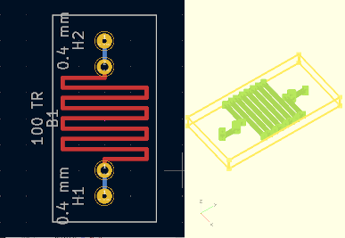

# fluidics

This repository contains code to help with design of fluidic circuits. It
leverages the existing Free Software tools [KiCAD](https://www.kicad.org/) and
[OpenSCAD](https://openscad.org/) to provide a complete, integrated workspace.

## Components
| Files | Description |
| :-- | :-- |
| `kiconvert.py` | Generates OpenSCAD files inside a KiCAD project. |
| `fluidics.kicad_sym` | KiCAD symbols for fluidics schematics. |
| `fluidics.pretty/*` | KiCAD footprints for fluidics components. |
| `lib/*` | OpenSCAD support files. |
| `lib/fluidics/*` | Component-specific OpenSCAD scripts. |
| `doc/*` | Project documentation. |
